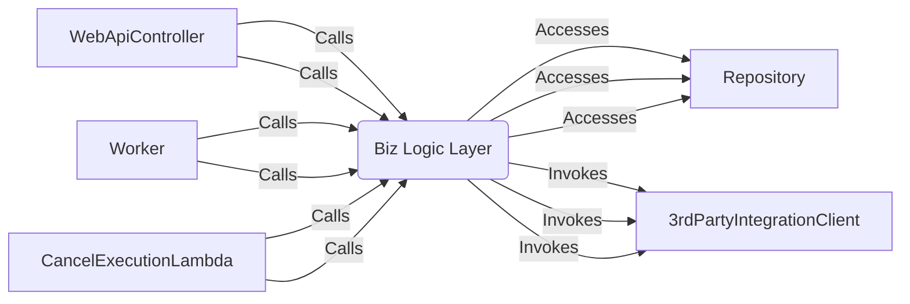

# Contributing to Payment Execution Service

Welcome to the Payment Execution Service project! This guide outlines how to contribute to our codebase, including our architecture, coding standards, and processes for submitting pull requests (PRs). We appreciate your contributions and look forward to collaborating with you!

## Table of Contents
- [Architecture and Patterns](#architecture-and-patterns)
- [Naming Convention and Coding Standard](#naming-convention-and-coding-standard)
- [Running the Code Locally](#running-the-code-locally)
- [Submitting a Pull Request](#submitting-a-pull-request)
- [Contact](#contact)

## Architecture and Patterns

### Monorepo Overview
This repository is a monorepo containing multiple independently deployable services:
- **WebAPI**: A RESTful API serving HTTP requests.
- **Worker**: A background processing service running on Kubernetes.
- **Cancel Execution Lambda**: An AWS Lambda function for cancelling abandoned payment requests.

These services share a common **Business Logic Layer** and **integration libraries** (e.g., database access via Entity Framework, third-party API clients like Stripe or AWS SQS).

The WebAPI, Worker, and Cancel Execution Lambda typically access integration libraries through the Business Logic Layer, ensuring a clear separation of concerns.

### Business Logic Layer
The business logic layer is implemented using the [MediatR](https://github.com/jbogard/MediatR) library with a tiny bit of hints of the Command and Query Responsibility Segregation (CQRS) pattern. Commands and queries are handled by `CommandHandlers`.

## Naming Convention and Coding Standard
We follow a consistent naming convention to ensure code readability and maintainability. Key guidelines include:
- **File Structure**: Interface and implementation are in the same file to make navigation easier. There could be exceptions, and we will evaluate that case by case. 
- **Test Names**: We follow the naming pattern of Given[Condition]_When[Action]_Then[ExpectedResult] (e.g. `GivenAValidPaymentRequest_WhenSubmitToPaymentExecution_ThenShouldReturn200OK`)
- **Database Entity names**: Use pascal case for db entity name (e.g., `PaymentTransaction` table).

For full details, refer to our [naming and coding standards](https://xero.atlassian.net/wiki/spaces/XFS/pages/270484178737/Code+structure+and+naming).

## Running the Code Locally

### Prerequisites
Before running the code locally, ensure you have the following installed:
- [.NET SDK](https://dotnet.microsoft.com/download) (version 8.0 or higher)
- [Docker](https://www.docker.com/) (for running the database locally)
- [Kubernetes CLI](https://kubernetes.io/docs/tasks/tools/) (optional, for Worker setup)

### Component Readmes
Follow the instructions in the respective readmes:
- [Payment Execution Service API](./projects/service/README.md)
- [Payment Execution Worker](./projects/worker/README.md)
- [Cancel Execution Lambda](./projects/lambdas/cancel/README.md)
- [Payment Execution Database](./projects/database/README.md)

## Submitting a Pull Request

Before requesting a PR review, ensure the following:

- [ ] All unit tests and GitHub Actions (GHA) checks have passed.
- [ ] The PR description includes:
  - **What**: A clear explanation of the changes.
  - **Why**: The reason for the changes (e.g., bug fix, new feature).
  - **How**: Steps to verify the changes (e.g., run specific tests, check API endpoints).
  - **Dependencies**: Any related PRs, services, or feature toggles required. If your change is behind a feature toggle (a mechanism to enable/disable features at runtime), specify the toggle name and how to test it.
- [ ] For external contributors:
  - Link to a JIRA ticket, design document, or provide sufficient context in the PR description.
- [ ] Fill out the PR template.

## Contact

For questions, bug or support, please reach out to the code owner via [payment execution platform slack channel](https://xero.enterprise.slack.com/archives/C07KW5G5F6U).
