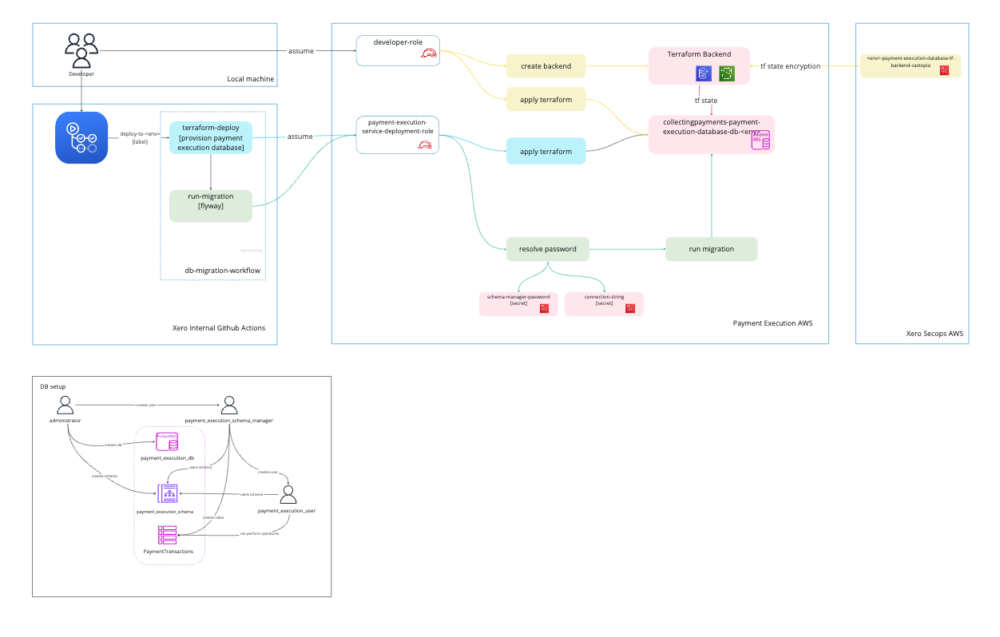

# Payment Execution Database

This project houses important scripts and infrastructure tooling for the payment execution database.
The db is manage by [kora aurora postgres](https://kora.xero.dev/aurora/postgres).

|RDS/cluster name| collectingpayments-execution-payment-execution-db-env|
|----------------|--------------------------------------------------------|
|Namespace       |cp-payment-execution                                     

## Structure


Infra contains two main sections:

- terraformBackend: bucket and locktable for managing terraform state for the database
- terraform: the actual terraform resources themselves associated with the database

migration_scripts holds the sequence of commands to run via flyway against the database
callback_scripts holds utility scripts for various actions required against the database (e.g. cleaning the users for phoenixing the db automatically in stage environment).

## Connecting to the database

```bash
> psql -h $DB_ENDPOINT -p 5432 -d postgres -U administrator -W
```

## Database Bootstrapping

On creation/full wipe of the database, the following bootstrapping process needs to occur:

---

#### Step 1
Run the [bootstrap script](./bootstrap.sql) as a SQL query to create the database directly using the administrator user.
Alternatively, you can pass the bootstrap sql file as input to `psql`. You can use the following make cmd:

```bash
make run-bootstrap DB_ENDPOINT='DB_ENDPOINT'
```

Note: You might be required to enter password the second time when you switch to `payment-execution-db`

#### Step 2:

Create the secrets manager secret for the schema manager password:

```bash
make create-secret-for-ENV NAME='collecting-payments-execution/collecting-payments-execution-payment-execution-database/payment-execution-db/schema-manager-password' DESCRIPTION='Schema manager user database password for payment request database schema' SECRET='<PASSWORD>'
```

Then change the password for the `payment_execution_schema_manager` user to match this new value via the admin console/connection:

```sql
ALTER USER payment_execution_schema_manager WITH PASSWORD '<password>';
```

#### Step 3:

Bootstrap a password and connection string for service connections by generating a password and creating a connection string to store in secrets manager at
`collecting-payments-execution/collecting-payments-execution-payment-execution-database/payment-execution-db/connection-string`.

The connection string should look something like (server example taken from test env):

```
Server=<DB_ENDPOINT>;Database=payment_execution_db;User Id=payment_execution_user;Password=<PASSWORD>;
```

This connection string is what is used by services to connect as a least priviledge user for querying the database

```sql
ALTER USER payment_execution_user WITH PASSWORD '<password>';
```

### Run migration locally
You can run migration locally by using the following make command which will spin up flyways migration inside docker and run migration scripts.

```bash
> make run-migration DB_ENDPOINT=$DB_ENDPOINT DB_PASSWORD=$DB_PASSWORD
```

## Made a mistake? How to clean the test database.

Since it's possible to run development migrations against our deployed environments - we've created a script to clean and re-run the migrations.

```shell
make clean-test 
```

This empties and drops all tables in the `payment_execution` schema, and callback scripts drop users created by the migrations.

> Note; since we drop and re-create the application user, we break existing connections using that user; resulting in error messages like `permission denied for schema payment_execution`. 
> If you clean the database, consider restarting or redeploying the runtimes connected to the datastore to establish a new connection and resolve the permissions issue.