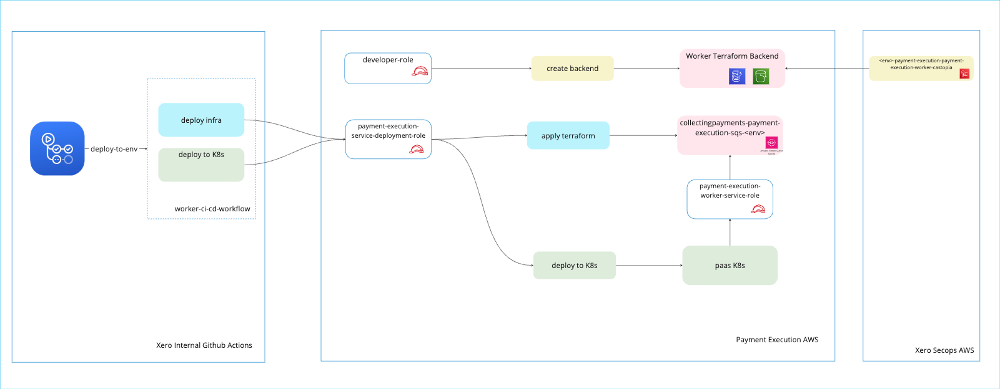

# Payment Execution Worker

Worker to process payment transaction from sqs queue.

## Infrastructure setup
Worker consists of queue and worker as a single deployable. The payment execution service deployment role is responsible for provisioning resources in git hub actions.

## Quick Links

- [Cortex](https://app.getcortexapp.com/admin/service?tenantCode=Xero&tag=C7XPVYdvJGXKZUbZawXUH2)
- [Deployment notifications](https://xero.slack.com/archives/cashtopia-releases)

## Documentation

- [Setting up your development environment](references/local-setup.md)
- [Developing this worker](references/developing-this-worker.md)
- [Build and deploy](references/build-and-deploy.md)
- [Logging and monitoring](references/logging-and-monitoring.md)
- [Keeping your Worker up-to-date](references/upgrade-support.md)
- [Consumer pact testing](./references/consumer-pact-testing.md)

## CodeOwners
- see CODEOWNERS file
---

Generated by the [Worker Accelerator](https://accelerators.xero.dev/docs/worker-accelerator/worker-accelerator/).
